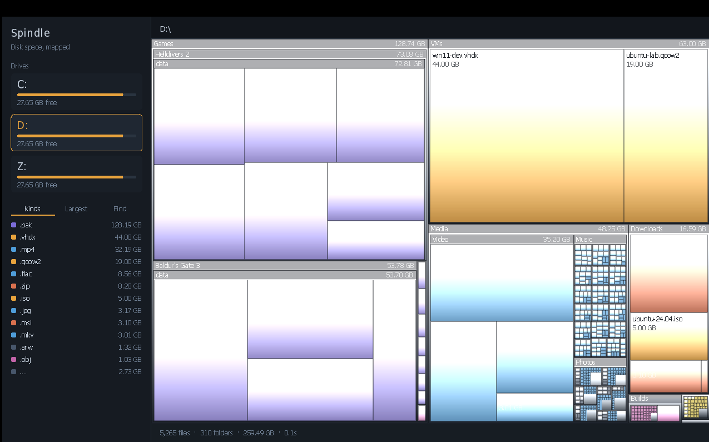

# Spindle

A disk space analyser for Windows. Native C++17, Win32 and Direct2D, no
runtime and no third-party libraries.



## Running it

`spindle.exe` is self-contained. Double-click it.

Run it elevated if you want the whole picture — unelevated, Windows hides
`Program Files\WindowsApps`, `System Volume Information` and other users'
profiles, which on a typical system is tens of gigabytes you cannot see.

| | |
|---|---|
| Click a drive | scan it |
| Click a block | descend into it |
| Ctrl+F | search names |
| Ctrl+E | export to CSV |
| Backspace / mouse-back | go up |
| Click a breadcrumb | jump to that level |
| Right-click a block | show in Explorer, copy path, recycle |
| F5 | rescan |
| Esc | cancel a running scan |

## What it does differently

**Colour means something.** WinDirStat assigns cell colours arbitrarily, so
the map tells you about sizes and nothing else. Spindle colours by what a file
*is* — media, archives, source, programs, disk images, databases — decided once
at scan time from the extension. A drive covered in amber is a drive full of
VM images, and you can see that before reading a single label.

**It reads the directory entry, never the file.** Sizes come out of
`WIN32_FIND_DATA`. No handle is opened on anything being scanned, so nothing
is locked, nothing is read, and files held under an exclusive kernel lock —
`pagefile.sys`, `hiberfil.sys` — still report their real size.

**Reparse points are never traversed.** Junctions and symlinks are recorded
but not followed, so nothing loops and nothing is counted twice.

**Filenames are treated as hostile input.** See below.

## Building

Requires MinGW-w64. Cross-compiles from Linux; also builds under MSYS2.

```
make            # build/spindle.exe
make test       # core tests under ASan + UBSan
make analyze    # cppcheck + clang-tidy
```

`src/core.cpp` — the treemap, categorisation and formatting — is deliberately
free of Windows headers so it compiles and runs under sanitizers on any host.
That is where the tests live.

## Architecture

```
src/spindle.h        types and interfaces
src/sync.h           SRWLOCK / CONDITION_VARIABLE, pthreads for host tests
src/workqueue.h      the scanner's work queue (testable on any host)
src/ntfs.h/.cpp      NTFS on-disk structures -- pure bytes, fuzz-tested
src/mft.cpp          raw volume I/O and tree assembly (Windows)
src/core.cpp         treemap, categorisation, reports, CSV (portable)
src/scan.cpp         parallel FindFirstFileEx walker, volume enumeration
src/ui.cpp           Win32 window, Direct2D renderer, navigation
res/spindle.rc       icon, version info, manifest
res/spindle.manifest DPI awareness, Common Controls v6, asInvoker
tools/make_icon.py   generates spindle.ico
```

The icon is the app's own visual language rather than a generic disc: an
asymmetric treemap in the category palette, amber dominant to match the
accent. Every size from 16 to 256 is drawn natively rather than downscaled
from one master, because a 16px downscale of a geometric mark loses its
structure. `make icon` regenerates it.

`tools/make_icon.py` uses the Python standard library only -- it rasterises,
encodes and packs the ICO itself. **Frame encoding is the whole story here.**
The container permits a frame to be a DIB or a PNG, but Windows only reliably
decodes PNG at 256x256. The first version of this used an imaging library
that wrote every frame as PNG, `LoadImage` failed outright, and the app
silently showed the stock Windows icon. So: DIB up to 128, PNG only at 256,
and `make icon` prints the encoding of each frame so a regression is visible.

The manifest declares `PerMonitorV2` DPI awareness as a fallback for builds
predating `SetProcessDpiAwarenessContext`, and `asInvoker` — Spindle never
requests elevation itself, since prompting on every launch to read protected
paths the user may not care about is the wrong default.

The scan runs on a pool of worker threads pulling from a shared queue, so a
single enormous directory doesn't leave one thread doing all the work. Each
directory's children are counted and the vector reserved *before* any pointer
into it is queued, which is what makes the child pointers stable without a
lock. Sizes are rolled up in a single-threaded post-order pass afterwards.

Layout is the squarified algorithm from Bruls, Huizing & van Wijk (2000).
Measured on random inputs it holds a mean aspect ratio of 1.19 with the worst
cell at 2.01, and covers the bounds to within 0.01%.


## Search

The Find panel takes a small query language. Bare words match the name;
prefixed terms narrow by kind, extension, size or type. Every term must match,
so a query reads as a sentence.

| | |
|---|---|
| `pak` | name contains "pak" |
| `"two words"` | quoted phrase |
| `kind:media` | one of the categories from the Kinds panel |
| `ext:vmdk` | exact extension |
| `>500mb` `<2gb` | size bounds — b/kb/mb/gb/tb, or bare bytes |
| `size:>1.5gb` | same, spelled out; fractions accepted |
| `is:file` `is:folder` | restrict to one or the other |
| `-temp` | name must **not** contain "temp" |

Combining is the point: `kind:media >500mb -temp` is "large media files that
aren't temporary", which is the actual question when a drive fills up. A row
of dropdowns would take longer to operate than typing that.

Size bounds apply to a folder's rolled-up total, so `is:folder >10gb` finds
the directories worth opening. Kind tokens accept several spellings — `vm`,
`vms`, `disk` and `iso` all reach the disk-image category — because people
type what they mean rather than what the enum is called.

Clicking a row in the **Kinds** panel searches for that extension, so the
breakdown doubles as the way into the results. Nothing is rejected: an
unrecognised token becomes a name term rather than an error, because a search
box that refuses input is worse than one that guesses.

Fuzzed with 40,000 generated queries built from adversarial fragments
(`>>>>`, `size:size:>`, `999999999999999999999999gb`, unbalanced quotes) plus
20,000 random unicode strings.

## Text rendering

Two things were cropping and misplacing labels.

**Line boxes are now pinned explicitly** rather than left to the font's own
metrics. Segoe UI at 19px needs about 25px of line box; the drive-letter label
was being given a 22px rect with `DRAW_TEXT_OPTIONS_CLIP`, so its bottom was
cut. Several 12px labels sat in exactly-16px rects, one pixel from the same
fate. Each format now sets uniform line spacing to a known value, every rect
is sized from that constant, and paragraph alignment is centred so a rect
that is a little too generous centres the text instead of pinning it to the
top -- and one that is a little too tight can no longer crop it. A lint over
the source checks all 24 text rects against their format's line box.

**Antialiasing is grayscale, not ClearType.** Subpixel rendering puts coloured
fringes on glyph edges. That is unobtrusive on white and clearly visible on a
dark background, particularly on the muted greys used for secondary text.

Also fixed: the two full-width status messages were left-aligned against the
edge of the map area rather than centred in it, and text alignment -- a
property of the shared format object -- was not being restored after a centred
or right-aligned draw, so it leaked into whatever drew next.

## Motion

Four animations, all short. The job of a transition is to show what moved, not
to be watched; past roughly 200 ms it starts to feel like waiting.

| | |
|---|---|
| Zoom on drill-in | 145 ms, easeOutQuint |
| First paint after a scan | 230 ms, staggered by depth |
| Hover | 80 ms fade |
| Panel underline | 130 ms slide |

**easeOutQuint** is the default because it covers 87% of the distance in the
first third of the duration. A symmetric curve over the same period feels
sluggish despite taking exactly as long — at t=0.33 an in-out cubic has moved
14% of the way, which the eye reads as hesitation.

The scan entrance staggers by depth, so top-level blocks settle first and
nested ones follow. The map assembles outside-in, which reads as structure
appearing rather than as one flat fade. Cells also settle inward very slightly
as they arrive, anchored on their own centre.

Hover is animated rather than binary, so sweeping the pointer across a
thousand blocks does not strobe, and the hovered cell lifts as well as gaining
an outline — the lift is what makes the pointer feel attached to the map.

Animations run on an 8 ms timer that stops the moment nothing is moving,
rather than a permanent repaint loop.

**Reduced motion is honoured.** `SPI_GETCLIENTAREAANIMATION` is read at
startup and on `WM_SETTINGCHANGE`; when it is off every duration becomes zero,
which skips the transitions rather than shortening them. Every easing curve
clamps out-of-range input, so a dropped frame cannot overshoot into a
position the layout never intended.

## Security review

The threat model is specific: this tool is meant to be pointed at directories
full of malware samples, so **filenames are attacker-controlled input** and
sizes come from a filesystem that may be corrupt or deliberately malformed.

Findings from the review, and what was done:

**Unsigned underflow in digit grouping.** `(i - lead) % 3` with `size_t`
operands wraps to `SIZE_MAX` when `lead == 2 && i == 1`, and `SIZE_MAX % 3`
is 0, so a separator landed in the wrong place. Only fired at 2, 5, 8… digit
lengths. Rewritten to count from the right; regression test walks every digit
length from 1 to 19.

**Unterminated buffer on `swprintf` failure.** `swprintf` returns negative on
encoding failure and does not guarantee a terminator. Constructing a
`std::wstring` from the raw buffer would read past its end. Three call sites
fixed to build from the reported length instead.

**Signed `wchar_t` bypassing the filename sanitizer.** `static_cast<uint32_t>`
on a negative `wchar_t` sign-extends to a value above every range check, so
the character passed through unfiltered. Not reachable on Windows, where
`wchar_t` is unsigned 16-bit, but wrong everywhere else and exactly the class
of bug that matters in this function. Now widens through
`std::make_unsigned_t<wchar_t>` first.

**Bidi override spoofing.** A sample named `invoice\u202Egpj.exe` renders as
`invoicexe.jpg` in any bidi-aware text stack. Spindle strips C0/C1 controls,
`U+202A`–`U+202E`, `U+2066`–`U+2069` and the zero-width formatting characters,
substituting `␣` so the removal is visible rather than silent. Fuzzed with
20,000 random names; nothing filtered survives.

**Integer overflow in size accumulation.** All size arithmetic goes through a
saturating add, so a volume reporting absurd sizes clamps instead of wrapping
to a small number and disappearing from the map.

**Unbounded recursion.** Layout recursion is bounded twice — by an explicit
depth limit and by a minimum cell size. The scanner's directory walk and both
tree-rollup passes use explicit stacks rather than recursion, because
extended-length paths permit far deeper nesting than `MAX_PATH` ever did.

**Deletion.** Recycle bin only (`FOF_ALLOWUNDO`), behind a confirmation
showing the full path and size, and refused outright on anything that looks
like a volume root. The `SHFileOperationW` path buffer is built with an
explicit double NUL rather than relying on the string's own terminator — a
missing second NUL makes the shell read past the buffer.

### Tooling

- 534 tests: 243 on the core, 78 on the NTFS parser (both under ASan and
  UBSan, both with fuzzing), 213 on the work queue under ThreadSanitizer and
  AddressSanitizer
- Fuzzing over both attacker-facing paths: random filenames, and random tree
  shapes with negative and zero-area bounds
- `cppcheck --enable=all` — no correctness or security findings
- `clang-tidy` with `bugprone-*`, `cert-*`, `clang-analyzer-*`,
  `concurrency-*` — clean but for one annotated false positive, where
  ownership passes across a `PostMessage` boundary the analyser cannot follow
- Builds clean at `-Wall -Wextra -Wpedantic -Wshadow -Wconversion
  -Wsign-conversion -Wcast-qual -Wcast-align -Wformat=2 -Wnull-dereference
  -Wold-style-cast`

### Binary mitigations

| | |
|---|---|
| DEP (`NX_COMPAT`) | on |
| ASLR (`DYNAMIC_BASE`) | on |
| 64-bit ASLR (`HIGH_ENTROPY_VA`) | on |
| `NO_SEH` | on |
| Stack cookies | `-fstack-protector-strong` |
| Auto-var init | `-ftrivial-auto-var-init=zero` |
| Control Flow Guard | **off** — MSVC-only (`/guard:cf`); GCC cannot emit it |

Imports only `KERNEL32`, `USER32`, `ADVAPI32`, `SHELL32`, `OLE32`, `DWMAPI`,
`D2D1`, `DWrite` and `msvcrt`. Statically linked, so there is no MinGW runtime
to ship with it.


## QA pass

Findings from a review after the first working build, in order of severity.

**Nested cell paths were wrong.** Cells nest up to five levels below the
directory being viewed, but the path was built as *breadcrumb + cell name*,
dropping every intermediate directory. "Show in Explorer" would open the wrong
place and **"Move to Recycle Bin" would target the wrong path**. Cells now
carry a parent index and the path is reconstructed by walking that chain;
the walk is bounded, so a corrupted link terminates rather than spinning.

**A superseded scan could overwrite a live one.** Clicking drive A then drive B
before A finished: A's completion message arrived after B's scan had reset the
cancel flag, so A's tree was adopted while B was still running — and the
handler joined B's thread, freezing the UI until B finished. Each scan now
carries a generation number and stale results are discarded.

**Labels overlapped.** A parent directory and its children both drew labels,
and since children are inset by only 1–3px the two landed on top of each other.
Expanded directories now reserve a label strip and children lay out below it;
a directory too small for a strip yields its label to the children drawn over
it. Verified by simulating the renderer's exact placement rules over 1,200
randomised trees — 199,414 drawn labels, zero overlapping pairs.

**DPI awareness was declared but never applied.** The process opted out of OS
scaling without telling Direct2D the real DPI, so on a 150% display the window
would be full size with everything inside it two-thirds too small. Now queries
the window DPI, sets it on the render target, converts mouse coordinates from
physical pixels to DIPs, and handles monitor-to-monitor moves.

**Window resize stuttered.** A relayout costs 10–15 ms on a large volume and
ran on every bounds change, so dragging an edge rebuilt the whole treemap each
frame. Cells are now scaled during a drag — the layout is area-proportional,
so uniform scaling looks near-identical — with a real rebuild once the drag
ends.

**White labels on light cells.** Amber and yellow cells had white text on them.
Label colour is now chosen from the WCAG relative luminance of the fill
composited against the background, so it flips to dark where that reads better.

Smaller: breadcrumbs were laid out head-first, so drilling a few levels down
pushed the current folder off the right edge — now tail-biased with a leading
ellipsis. The legend listed every category whether or not it appeared on
screen — now shows only what is present, with a size against each. Truncated
names were hard-clipped mid-word — now ellipsised. The context menu is
suppressed mid-zoom, where hit testing uses final positions that don't match
what is drawn.

### Measured

On a synthetic tree with a realistic heavy-tailed size distribution:

| | |
|---|---|
| Tree | 1.93M files, 2.92 TB |
| Memory | ~170 MB on Windows (276 MB measured with 4-byte `wchar_t`) |
| Cells at 1080p | ~11,000 |
| Treemap rebuild | 11–15 ms |
| Hit test per mouse move | 0.012 ms |

Memory is roughly 90 bytes plus the filename per node. A full `C:` scan of
1.6M files lands near 170 MB. That is the cost of holding the whole tree so
navigation is instant; a string pool and index-based tree would cut it
substantially and is the obvious next optimisation.


## The crash

Reported as crashing during large scans. Small volumes were fine; a full `C:`
was not.

**The cause was the toolchain, not the logic.** MinGW-w64 ships GCC in two
threading models. This was built with `gcc version 13-win32`, and under the
win32 model the C++ standard threading types — `std::thread`, `std::mutex`,
`std::condition_variable` — sit on a comparatively young implementation. A
sixteen-thread scanner making hundreds of thousands of lock acquisitions and
condition-variable waits, sustained for several seconds, is close to the
harshest thing you can point at it.

Sanitizers never saw it: on the host they exercise glibc's threading, not
MinGW's.

The fix is to stop depending on that layer. Synchronisation is now SRWLOCK and
CONDITION_VARIABLE directly, and threads are `_beginthreadex`. Both are what
the OS is built on, both are lighter than the standard types, and the binary
now behaves identically whichever MinGW variant compiles it — verified by
building under both models and confirming the imports are byte-for-byte the
same set, with no threading runtime in either.

Fixed alongside it, since each would also crash under load:

**Exceptions escaping a thread.** An exception leaving a thread function calls
`std::terminate`, which kills the process with no dialog and no report. A scan
of a large volume performs millions of allocations, so a single `bad_alloc`
took the whole application down. Both thread entry points now catch, and a
failed scan reports itself rather than presenting a truncated tree as
complete.

**Find handles leaked on the exception path.** `FindClose` was called at the
end of the enumeration loop, so any throw part-way through leaked the handle.
Sixteen threads leaking one per failure exhausts them quickly. Now RAII.

**Thread creation was unchecked.** If `_beginthreadex` fails part-way through
building the pool, the threads already running hold a pointer to a stack
object in the function that is about to return. Now the pool starts with
however many threads it can get, and falls back to running inline if it gets
none.

### Making it testable

The work queue is where the fault lived, so it no longer lives inside
`scan.cpp` as untestable Windows-only code. `src/sync.h` provides the
primitives with a Win32 implementation and a pthreads one; `src/workqueue.h`
holds the queue itself. The Windows build uses the Win32 path; the tests
compile the identical queue against pthreads and run it under
ThreadSanitizer.

`make test` runs 213 concurrency assertions over the state machine: complete
drain and termination at 1 through 32 threads, 40 trials of 32 threads racing
for a single seed item (the scanner's actual startup shape, where most workers
begin by waiting), 60 trials cancelled mid-flight, stop-before-start,
empty-queue, and 49,140 items of heavy contention at 24 threads. Clean under
both ThreadSanitizer and AddressSanitizer.

`make stress` walks a real directory tree with the scanner's exact worker
structure under TSan, including repeated mid-scan cancellation.

### If it still falls over

There is now a crash handler. It writes `spindle-crash.txt` next to the
executable with the exception code and — the part that matters — the faulting
address as an **offset from the module base**, plus return addresses in the
same form. Under ASLR a raw address is different every run and tells you
nothing; base+offset maps straight onto the binary, so it can be symbolised
against a `-g` build. `std::terminate` is hooked separately, since it does not
route through the exception filter.


## Speed

Scanning uses the NTFS Master File Table when it can. Instead of a syscall
round trip per directory, that is a handful of large sequential reads of the
volume's own index, and it is the difference between several seconds and well
under one on a million-file drive. It is the same technique WizTree is built
around.

It needs a local NTFS volume and an elevated process, because raw volume
access is an administrator privilege. When any of that is missing — a network
share, exFAT, no elevation — Spindle falls back to the parallel directory walk
without saying anything, because the answer is the same either way. The status
bar shows `MFT` when the fast path ran.

Report timings on a synthetic 1.9M-file tree, after optimisation:

| | before | after |
|---|---|---|
| Extension breakdown | 122 ms | **64 ms** |
| Largest files | 46 ms | **28 ms** |
| Name search | 45 ms | **25 ms** |
| Treemap rebuild | — | 13 ms |
| Hit test per mouse move | — | 0.012 ms |

The gains came from two changes. Extensions are aggregated by a hash computed
in place rather than by building a lower-cased string per file — that was
1.9 million allocations for a table with a few hundred rows. And the path
walker now only maintains the prefix for directories, joining the leaf name
only for rows a caller actually keeps; previously every file's full path was
built and immediately discarded.

## What it does that the others do

Feature parity was set by looking at WizTree, WinDirStat, TreeSize and
SpaceSniffer, and taking what they all converge on.

| | Spindle |
|---|---|
| MFT scanning | yes, with automatic fallback |
| Treemap | yes, coloured by file kind |
| Extension breakdown | **Kinds** panel |
| Largest files list | **Largest** panel |
| Name search | **Find** panel, Ctrl+F, with a query language |
| Filter by type/size | `kind:`, `ext:`, `>500mb`, `is:folder`, `-exclude` |
| CSV export | Ctrl+E, RFC 4180, UTF-8 with BOM |
| Delete from within | recycle bin only, confirmed |
| Show in Explorer | right-click, or click a list row |
| Portable single file | yes, no installer, no runtime |

The side panel is the part a treemap alone does not give you. A map answers
*where* space went; the Kinds and Largest panels answer *what* — which is
usually the question that leads to a decision.

Not implemented: duplicate detection (WizTree and WinDirStat have it), scan
scheduling, and network share discovery.


## Search

The Find panel takes a small query language. Bare words match the name;
prefixed terms narrow by kind, extension, size or type. Every term must match,
so a query reads as a sentence.

| | |
|---|---|
| `pak` | name contains "pak" |
| `"two words"` | quoted phrase |
| `kind:media` | one of the categories from the Kinds panel |
| `ext:vmdk` | exact extension |
| `>500mb` `<2gb` | size bounds — b/kb/mb/gb/tb, or bare bytes |
| `size:>1.5gb` | same, spelled out; fractions accepted |
| `is:file` `is:folder` | restrict to one or the other |
| `-temp` | name must **not** contain "temp" |

Combining is the point: `kind:media >500mb -temp` is "large media files that
aren't temporary", which is the actual question when a drive fills up. A row
of dropdowns would take longer to operate than typing that.

Size bounds apply to a folder's rolled-up total, so `is:folder >10gb` finds
the directories worth opening. Kind tokens accept several spellings — `vm`,
`vms`, `disk` and `iso` all reach the disk-image category — because people
type what they mean rather than what the enum is called.

Clicking a row in the **Kinds** panel searches for that extension, so the
breakdown doubles as the way into the results. Nothing is rejected: an
unrecognised token becomes a name term rather than an error, because a search
box that refuses input is worse than one that guesses.

Fuzzed with 40,000 generated queries built from adversarial fragments
(`>>>>`, `size:size:>`, `999999999999999999999999gb`, unbalanced quotes) plus
20,000 random unicode strings.

## Text rendering

Two things were cropping and misplacing labels.

**Line boxes are now pinned explicitly** rather than left to the font's own
metrics. Segoe UI at 19px needs about 25px of line box; the drive-letter label
was being given a 22px rect with `DRAW_TEXT_OPTIONS_CLIP`, so its bottom was
cut. Several 12px labels sat in exactly-16px rects, one pixel from the same
fate. Each format now sets uniform line spacing to a known value, every rect
is sized from that constant, and paragraph alignment is centred so a rect
that is a little too generous centres the text instead of pinning it to the
top -- and one that is a little too tight can no longer crop it. A lint over
the source checks all 24 text rects against their format's line box.

**Antialiasing is grayscale, not ClearType.** Subpixel rendering puts coloured
fringes on glyph edges. That is unobtrusive on white and clearly visible on a
dark background, particularly on the muted greys used for secondary text.

Also fixed: the two full-width status messages were left-aligned against the
edge of the map area rather than centred in it, and text alignment -- a
property of the shared format object -- was not being restored after a centred
or right-aligned draw, so it leaked into whatever drew next.

## Motion

Four animations, all short. The job of a transition is to show what moved, not
to be watched; past roughly 200 ms it starts to feel like waiting.

| | |
|---|---|
| Zoom on drill-in | 145 ms, easeOutQuint |
| First paint after a scan | 230 ms, staggered by depth |
| Hover | 80 ms fade |
| Panel underline | 130 ms slide |

**easeOutQuint** is the default because it covers 87% of the distance in the
first third of the duration. A symmetric curve over the same period feels
sluggish despite taking exactly as long — at t=0.33 an in-out cubic has moved
14% of the way, which the eye reads as hesitation.

The scan entrance staggers by depth, so top-level blocks settle first and
nested ones follow. The map assembles outside-in, which reads as structure
appearing rather than as one flat fade. Cells also settle inward very slightly
as they arrive, anchored on their own centre.

Hover is animated rather than binary, so sweeping the pointer across a
thousand blocks does not strobe, and the hovered cell lifts as well as gaining
an outline — the lift is what makes the pointer feel attached to the map.

Animations run on an 8 ms timer that stops the moment nothing is moving,
rather than a permanent repaint loop.

**Reduced motion is honoured.** `SPI_GETCLIENTAREAANIMATION` is read at
startup and on `WM_SETTINGCHANGE`; when it is off every duration becomes zero,
which skips the transitions rather than shortening them. Every easing curve
clamps out-of-range input, so a dropped frame cannot overshoot into a
position the layout never intended.

## Security

The threat model is specific and it drove several decisions.

**MFT parsing treats the disk as hostile.** Reading the Master File Table
means interpreting raw on-disk structures while running elevated. A crafted
VHD, a corrupt volume, or a USB stick with a hand-edited boot sector all reach
that code. So `src/ntfs.cpp` handles nothing but bytes, knows nothing about
Windows, and can therefore be fuzzed on any host — which is exactly what
`make test` does. Every field goes through a cursor that cannot read past its
buffer; no length, offset or count off the disk is used without validation.

Fuzzing found two real bugs there immediately, both reachable from a crafted
filesystem: a 64-bit shift in the run-list sign extension (undefined behaviour
whenever the offset field is eight bytes wide), and a signed overflow
accumulating the cluster delta. 78 assertions now cover it, including 60,000
corrupted records, 40,000 random buffers, and every truncation offset of a
valid structure.

**The volume is opened read-only.** `FILE_READ_DATA`, sharing read, write and
delete, so a scan can never interfere with a volume in use.

**Filenames are attacker-controlled** and are sanitised before display *and*
before export — a name carrying a bidi override would otherwise be written
verbatim into a CSV and carry the spoof into whatever opens it.

### Import audit

160 functions across 10 DLLs, all Microsoft. What is *not* there matters more
than what is:

- **No network APIs.** No Winsock, WinINet, WinHTTP, or DNS. The program has
  no code path that can reach the network.
- **No registry writes.** No `RegSetValue`, `RegCreateKey`, no persistence.
- **No process creation.** No `CreateProcess`, no `WinExec`. `ShellExecuteW`
  is present and used for exactly one thing: opening Explorer at a path.
- **No injection primitives.** No `CreateRemoteThread`, `WriteProcessMemory`,
  `VirtualAllocEx`, or `SetWindowsHookEx`.

Three imports look alarming in a scanner and are worth naming:

- `OpenProcessToken` — `GetCurrentProcess()` with `TOKEN_QUERY`, solely to
  ask whether the process is elevated before attempting MFT access.
- `LoadLibraryW`, `VirtualProtect`, `CryptGenRandom` — **not called by any
  line of Spindle**. They come from the MinGW C runtime's startup and
  exception unwinding. `grep` the sources and you will not find them.
- `CreateFileW` appears three times: read-only on the raw volume, and
  `GENERIC_WRITE` on exactly two paths — the CSV file the user picked in a
  save dialog, and the crash report.

Everything is verifiable from the source, which is included. Nothing is
downloaded, nothing is generated at build time except the icon.

## Known limits

Sizes are logical file length, so compressed, sparse and deduplicated files
read larger than their actual footprint on disk. `WinSxS` in particular is
heavily hardlinked and its apparent size is not reclaimable space.

Reading the NTFS `$MFT` directly would be faster still than
`FindFirstFileEx`, but needs a raw volume handle and administrator rights for
a scan that already completes in a few seconds.
