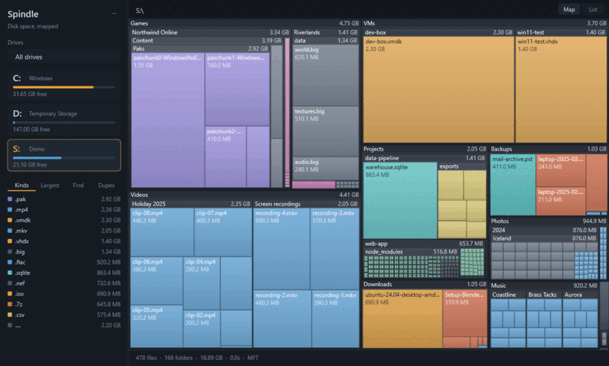
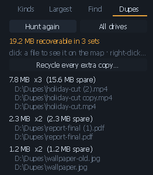

# Spindle

A disk space analyser for Windows. Native C++17, Win32 and Direct2D, no
runtime and no third-party libraries.




## Running it

`spindle.exe` is self-contained. Double-click it.

Run it elevated if you want the whole picture. Without elevation Windows
hides `Program Files\WindowsApps`, `System Volume Information` and other
users' profiles, which on a typical system adds up to tens of gigabytes.

| | |
|---|---|
| Click a drive | scan it |
| Click a block | descend into it |
| Ctrl+F | search names |
| Ctrl+E | export to CSV |
| Backspace / mouse-back | go up |
| Click a breadcrumb | jump to that level |
| Right-click a block | show in Explorer, copy path, recycle, force remove |
| F5 | rescan |
| Esc | cancel a running scan |

## What it does differently

Colour carries information. WinDirStat assigns cell colours arbitrarily, so
its map only shows sizes. Spindle colours each file by what it is (media,
archives, source, programs, disk images, databases), decided at scan time
from the extension, so you can tell what a drive is full of before reading
any labels.

Scanning reads directory entries, never file contents. Sizes come from
`WIN32_FIND_DATA` and no handle is opened on anything being scanned, so
nothing gets locked, and files held under an exclusive kernel lock such as
`pagefile.sys` and `hiberfil.sys` still report their real size.

Reparse points are recorded but not traversed. Junctions and symlinks
cannot cause loops or double counting.

At launch, the fixed drives are walked once in the background, one at a
time, and the status bar notes it while it runs. After a few minutes every
drive answers a click instantly. Finished scans are cached under
`%LOCALAPPDATA%\Spindle`. A cache under five minutes old is served as-is;
an older one is shown immediately while a rescan revalidates behind it, and
the status bar reads `cached 2h ago · rescanning` until it finishes. F5
always forces a fresh walk. Removable and network drives are never read
unprompted, the background walk stops the moment you ask for anything
else, and the whole thing can be turned off in the `···` menu. The cache
is keyed to the volume serial and parsed with the same validation as
everything else read from disk.

Views come in tabs. Right-click a folder and open it in its own tab;
right-click a duplicate and its drive opens in one, with the file
outlined. Each tab remembers its drive, its position in the tree and its
panel, and switching is instant because the caches already hold every
drive. The strip only appears once there are two tabs to choose from.


Filenames are treated as untrusted input; see the Security section.

Force removal handles the things that will not delete normally: locked
files, folders with broken ACLs, leftovers from an uninstaller that no
longer exists. Right-click, then Force remove. It deletes permanently,
takes ownership when access is denied, and ends the processes holding the
target open, found through the Restart Manager the same way Windows finds
them. No injection, no handle-table tricks.

Force applies to locks and permissions, not to the confirmations. It is a
separate menu item below the reversible delete, it is never the default,
and it has no keyboard shortcut. It asks three times: for the
protected-path check, for the permanent deletion (with size and file
count), and for the processes it would end, listed by name. No is the
default answer each time. Drive roots, `\Windows`, `System Volume
Information`, the boot files and the `Program Files`, `ProgramData` and
`Users` roots are refused in the removal code itself, not just in the
dialog. It never terminates a system process and never touches the
registry.

## Duplicates



Finding duplicates means reading file contents, which the scanner
otherwise never does, so it only happens when you press the button in the
Dupes panel. The search runs in tiers so that very little is read in full:

1. Same size. Files of different lengths cannot be identical, so this
   free test eliminates almost everything.
2. First 16 KB, then last 16 KB, and for files past 8 MB another 16 KB
   at the quarter, middle and three-quarter marks. Most same-size files
   differ within the first few kilobytes. Disk images are the awkward
   case: two different fixed-size VM images can share the boot sector at
   the head and the footer at the tail, and the interior probes reject
   those for kilobytes where reading them out would cost gigabytes.
3. Full content, only for what survives. A group of exactly two, the
   common case, is confirmed by comparing the files byte for byte, which
   is exact and stops at the first difference. Groups of three or more
   are grouped by a 128-bit digest, which is O(n) reads instead of the
   O(n squared) of comparing every pair.

Measured on twenty 100 MB files that share a size and differ at the first
byte, the worst case for tools that hash everything, Spindle reads 320 KB
where hashing each file in full would read 2 GB.

Cloud placeholders are never downloaded for comparison. OneDrive files
are recognised and skipped, and the read path refuses a file that became
a placeholder after the scan rather than fetching it. Hardlinks are
excluded because they are already the same bytes and deleting one frees
nothing.

Click a result and Spindle shows the file on its own map: it switches to
the right drive, walks the tree to the file and outlines its cell, and
while the Dupes tab is open every file in the report carries a thin
outline so the duplicates are visible in place. Right-click a result for
Explorer, or to recycle that one copy.

Recycling in bulk is a single button: "Recycle every extra copy" keeps
the first copy of each set and sends the rest to the Recycle Bin, after
one confirmation that states the file count, the set count and the
total size, with No as the default. Every extra is verified byte for
byte against its kept copy immediately before it is recycled, so the
last copy can never go and a stale result cannot delete the wrong
thing; a set that no longer matches is skipped whole and said so. The
run shows its progress, can be stopped by Esc or a click, and ends with
an exact accounting of what moved and what was skipped.
The delete only proceeds after Spindle has re-verified, byte for byte,
that another identical copy still exists, so the last copy can never be
the one deleted, and a hash match alone is never enough. Deletion goes to
the Recycle Bin and asks first.

The second button, "Across every scanned drive", pools candidates from
every drive's remembered scan. That finds the file that exists once on
`C:` and once on `D:`, which a single-folder search cannot see. Each row
shows which drive it is on.

## What's really reclaimable

Sizes are logical file length, which overstates what deleting would
actually free. The status bar reports the two cases that matter:

Hardlinked bytes exist once no matter how many names point at them.
WinSxS is built this way and most of its apparent size is not
recoverable. On the MFT path, where the link count comes for free,
hardlinked files are marked and their bytes totalled separately.

Cloud-only bytes are not on the disk at all. A OneDrive placeholder has a
nominal size but occupies little or no local space, so it is counted
separately instead of being folded into a figure that claims local space.

## Comparing scans

The cache keeps the last finished scan of each drive, so answering "what
ate my disk this week" needs nothing extra. Compare with the cached scan,
in the `···` menu, diffs the current tree against the cache: what grew,
shrank, appeared and vanished, largest movement first, with a one-megabyte
floor to keep the list short. A folder that appeared is reported once at
its root rather than as thousands of files inside it.

## Command line

The command line lets Task Scheduler handle scheduling, and it is also how
a UNC path gets scanned, since the window only lists lettered volumes.

```
spindle.exe [path]                 open the window on a volume, folder or
                                     \\server\share
spindle.exe --csv <file> <path>    scan, write CSV, exit; no window
spindle.exe --duplicates [bytes] <path>   include a duplicate report
spindle.exe --version | --help
```

With `--csv` nothing is shown and the exit code is 0 on success, 1 on
failure, so a scheduled task can act on the result. Anything beginning
with a dash is treated as a mistyped option rather than a path, so a typo
cannot start a scan by accident.

Spindle can also add a "Scan with Spindle" entry to folder right-click
menus, from the `···` menu. It is off by default and is the only registry
write in the program: per-user under `HKCU`, no elevation, and unticking
removes exactly the keys that ticking created.

## Speed

Scanning uses the NTFS Master File Table when it can. Instead of a
syscall round trip per directory it does a handful of large sequential
reads of the volume's own index, which is the difference between several
seconds and well under one on a million-file drive. WizTree is built
around the same technique.

The MFT path needs a local NTFS volume and an elevated process, because
raw volume access requires administrator rights. When any of that is
missing (a network share, exFAT, no elevation) Spindle falls back to the
parallel directory walk. The status bar shows `MFT` when the fast path
ran.

Report timings on a synthetic 1.9M-file tree, after optimisation:

| | before | after |
|---|---|---|
| Extension breakdown | 122 ms | 64 ms |
| Largest files | 46 ms | 28 ms |
| Name search | 45 ms | 25 ms |
| Treemap rebuild | n/a | 13 ms |
| Hit test per mouse move | n/a | 0.012 ms |

The gains came from two changes. Extensions are aggregated by a hash
computed in place instead of building a lower-cased string per file,
which had been 1.9 million allocations for a table with a few hundred
rows. And the path walker now only maintains the prefix for directories,
joining the leaf name for rows a caller actually keeps, where previously
every file's full path was built and immediately thrown away.

## Feature comparison

Feature parity was set by looking at WizTree, WinDirStat, TreeSize and
SpaceSniffer and taking what they converge on.

| | Spindle |
|---|---|
| MFT scanning | yes, with automatic fallback |
| Treemap | yes, coloured by file kind |
| Extension breakdown | Kinds panel |
| Largest files list | Largest panel |
| Name search | Find panel, Ctrl+F, with a query language |
| Filter by type/size | `kind:`, `ext:`, `>500mb`, `is:folder`, `-exclude` |
| CSV export | Ctrl+E, RFC 4180, UTF-8 with BOM |
| Delete from within | recycle bin, confirmed; force remove for the stuck |
| Duplicate finder | tiered, cross-drive, byte-verified before any delete |
| Scan comparison | against the cached scan |
| Command line | `--csv`, `--duplicates`, UNC paths |
| Show in Explorer | right-click, or click a list row |
| Portable single file | yes, no installer, no runtime |

The side panel is the part a treemap alone does not give you. The map
shows where the space went; the Kinds and Largest panels show what it
went to, which is usually the question that leads to a decision.

Not implemented: network share discovery. A share is scanned by giving
its UNC path explicitly.

## Building

Requires MinGW-w64. Cross-compiles for x86-64 from Linux (also builds
under MSYS2), and for ARM64 with llvm-mingw via `make ARCH=aarch64`.

```
make            # build/spindle.exe
make test       # 900+ assertions under ASan, UBSan and ThreadSanitizer
make stress     # the scanner's concurrency structure over a real tree
make analyze    # cppcheck + clang-tidy
```

`src/core.cpp` (the treemap, categorisation and formatting) is
deliberately free of Windows headers, so it compiles and runs under
sanitizers on any host. That is where most of the tests live.

## Architecture

```
src/spindle.h        types and interfaces
src/sync.h           SRWLOCK / CONDITION_VARIABLE, pthreads for host tests
src/workqueue.h      the scanner's work queue (testable on any host)
src/ntfs.h/.cpp      NTFS on-disk structures, pure bytes, fuzz-tested
src/mft.cpp          raw volume I/O and tree assembly (Windows)
src/core.cpp         treemap, categorisation, reports, CSV (portable)
src/scan.cpp         parallel FindFirstFileEx walker, volume enumeration
src/ui.cpp           Win32 window, Direct2D renderer, navigation
res/spindle.rc       icon, version info, manifest
res/spindle.manifest DPI awareness, Common Controls v6, asInvoker
tools/make_icon.py   generates spindle.ico
```

The icon is an asymmetric treemap in the category palette rather than a
generic disc, with amber dominant to match the accent. Every size from 16
to 256 is drawn natively instead of downscaled from one master, because a
16px downscale of a geometric mark loses its structure. `make icon`
regenerates it.

`tools/make_icon.py` uses only the Python standard library; it
rasterises, encodes and packs the ICO itself. Frame encoding is the part
that matters: the ICO container allows DIB or PNG frames, but Windows
only reliably decodes PNG at 256x256. An earlier version wrote every
frame as PNG through an imaging library, `LoadImage` failed, and the app
silently showed the stock Windows icon. Frames are now DIB up to 128 and
PNG only at 256, and `make icon` prints each frame's encoding so a
regression is visible.

The manifest declares `PerMonitorV2` DPI awareness as a fallback for
builds predating `SetProcessDpiAwarenessContext`, and `asInvoker`.
Spindle never requests elevation itself, because prompting on every
launch to read protected paths the user may not care about is the wrong
default.

The scan runs on a pool of worker threads pulling from a shared queue, so
one enormous directory does not leave a single thread doing all the work.
Each directory's children are counted and the vector reserved before any
pointer into it is queued, which is what keeps the child pointers stable
without a lock. Sizes are rolled up in a single-threaded post-order pass
afterwards.

Layout is the squarified algorithm from Bruls, Huizing and van Wijk
(2000). Measured on random inputs it holds a mean aspect ratio of 1.19
with the worst cell at 2.01, and covers the bounds to within 0.01%.

## Search

The Find panel takes a small query language. Bare words match the name,
prefixed terms narrow by kind, extension, size or type, and every term
must match.

| | |
|---|---|
| `pak` | name contains "pak" |
| `"two words"` | quoted phrase |
| `kind:media` | one of the categories from the Kinds panel |
| `ext:vmdk` | exact extension |
| `>500mb` `<2gb` | size bounds in b/kb/mb/gb/tb, or bare bytes |
| `size:>1.5gb` | same, spelled out; fractions accepted |
| `is:file` `is:folder` | restrict to one or the other |
| `-temp` | name must not contain "temp" |

`kind:media >500mb -temp` reads as "large media files that aren't
temporary", which is usually the real question when a drive fills up, and
typing it is faster than a row of dropdowns would be to operate.

Size bounds apply to a folder's rolled-up total, so `is:folder >10gb`
finds the directories worth opening. Kind tokens accept several spellings
(`vm`, `vms`, `disk` and `iso` all reach the disk-image category) because
people type what they mean rather than what the enum is called.

Clicking a row in the Kinds panel searches for that extension, so the
breakdown doubles as a way into the results. An unrecognised token
becomes a name term rather than an error.

Fuzzed with 40,000 generated queries built from adversarial fragments
(`>>>>`, `size:size:>`, `999999999999999999999999gb`, unbalanced quotes)
plus 20,000 random unicode strings.

## Text rendering

Two classes of label bug were fixed.

Line boxes are pinned explicitly rather than left to the font's own
metrics. Segoe UI at 19px needs about 25px of line box, and the
drive-letter label had a 22px rect with `DRAW_TEXT_OPTIONS_CLIP`, so its
bottom was cut off. Several 12px labels sat in 16px rects, one pixel from
the same problem. Each format now sets uniform line spacing to a known
value, every rect is sized from that constant, and paragraph alignment is
centred, so a slightly generous rect centres the text and a slightly
tight one no longer crops it. A lint over the source checks all 24 text
rects against their format's line box.

Antialiasing is grayscale rather than ClearType. Subpixel rendering puts
coloured fringes on glyph edges, which is unobtrusive on white and
clearly visible on a dark background, especially on muted greys.

Also fixed: two full-width status messages were left-aligned against the
edge of the map area instead of centred in it, and text alignment (a
property of the shared format object) was not being restored after a
centred or right-aligned draw, so it leaked into whatever drew next.

## Motion

Four animations, all short. Past roughly 200 ms a transition starts to
feel like waiting.

| | |
|---|---|
| Zoom on drill-in | 145 ms, easeOutQuint |
| First paint after a scan | 230 ms, staggered by depth |
| Hover | 80 ms fade |
| Panel underline | 130 ms slide |

easeOutQuint is the default because it covers 87% of the distance in the
first third of the duration. A symmetric curve over the same period feels
sluggish even though it takes exactly as long: at t=0.33 an in-out cubic
has only moved 14% of the way, and the eye reads that as hesitation.

The scan entrance staggers by depth, so top-level blocks settle first and
nested ones follow, and the map assembles outside-in. Cells also settle
slightly inward as they arrive, anchored on their own centre.

Hover is animated rather than binary, so sweeping the pointer across a
thousand blocks does not strobe. The hovered cell lifts slightly as well
as gaining an outline.

Animations run on an 8 ms timer that stops as soon as nothing is moving.
There is no permanent repaint loop.

Reduced motion is honoured. `SPI_GETCLIENTAREAANIMATION` is read at
startup and on `WM_SETTINGCHANGE`, and when it is off every duration
becomes zero, which skips the transitions rather than shortening them.
Easing curves clamp out-of-range input, so a dropped frame cannot
overshoot into a position the layout never intended.

## Security

The threat model drove several decisions.

MFT parsing treats the disk as hostile. Reading the Master File Table
means interpreting raw on-disk structures while running elevated, and a
crafted VHD, a corrupt volume, or a USB stick with a hand-edited boot
sector all reach that code. `src/ntfs.cpp` therefore handles nothing but
bytes, knows nothing about Windows, and is fuzzed on the host as part of
`make test`. Every field goes through a cursor that cannot read past its
buffer, and no length, offset or count taken from the disk is used
without validation.

Fuzzing found two real bugs immediately, both reachable from a crafted
filesystem: a 64-bit shift in the run-list sign extension (undefined
behaviour whenever the offset field is eight bytes wide) and a signed
overflow accumulating the cluster delta. 78 assertions now cover the
parser, including 60,000 corrupted records, 40,000 random buffers, and
every truncation offset of a valid structure.

The volume is opened read-only, `FILE_READ_DATA` with read, write and
delete sharing, so a scan cannot interfere with a volume in use.

Filenames are attacker-controlled and are sanitised before display and
before export. A name carrying a bidi override would otherwise be
written verbatim into a CSV and carry the spoof into whatever opens it.

### Import audit

About 210 functions across 11 DLLs, all Microsoft. What is absent
matters as much as what is present:

- No network APIs. No Winsock, WinINet, WinHTTP or DNS. There is no code
  path that can reach the network.
- No process creation. No `CreateProcess`, no `WinExec`. `ShellExecuteW`
  is used to open Explorer at a path and for nothing else.
- No injection primitives. No `CreateRemoteThread`, `WriteProcessMemory`,
  `VirtualAllocEx` or `SetWindowsHookEx`.
- Registry writes happen in exactly one feature: the opt-in "Scan with
  Spindle" Explorer entry, per-user under `HKCU`, added and removed from
  the `···` menu. Nothing else touches the registry and nothing runs at
  startup.

Some imports deserve an explanation:

- `OpenProcessToken` is called on `GetCurrentProcess()` with
  `TOKEN_QUERY`, solely to ask whether the process is elevated before
  attempting MFT access.
- `TerminateProcess` is reached only from Force remove, on the processes
  the Restart Manager reports as holding the target, after they are
  listed to the user by name and confirmed. System processes are refused.
- `LoadLibraryW`, `VirtualProtect` and `CryptGenRandom` are not called by
  any line of Spindle. They come from the MinGW C runtime's startup and
  exception unwinding; grep the sources and you will not find them.
- Write handles are opened for the scan cache, the CSV file picked in the
  save dialog, and the crash report. Deletion happens only through the
  two delete commands, both confirmed.

Everything is verifiable from the source, which is included. Nothing is
downloaded, and nothing is generated at build time except the icon.

## Known limits

Sizes are logical file length, so compressed and sparse files read larger
than their footprint on disk. Hardlinked and cloud-only bytes are the two
cases large enough to matter and both are measured and reported;
compression is not.
