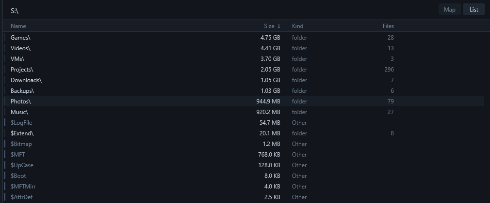
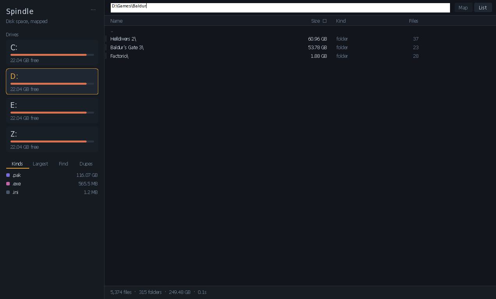
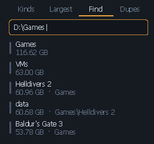
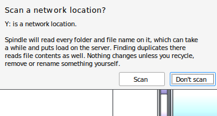

<p align="center">
  
</p>

<h1 align="center">Spindle</h1>

<p align="center"><strong>A disk space analyser for Windows. It shows what a drive is full of, not just how full it is.</strong></p>

<p align="center">
  
  
  
  <a href="LICENSE"></a>
  <a href="https://github.com/thetrueartist/spindle/releases/latest"></a>
  <a href="https://github.com/thetrueartist/spindle/actions/workflows/ci.yml"></a>
</p>


Native C++17, Win32 and Direct2D, no runtime and no third-party code, in
one portable executable of about 1.5 MB.

Scan a drive and see where the space went as a treemap coloured by what
the files are. The side panel breaks the drive down by kind, lists the
largest files, searches with a small query language and finds
duplicates while reading as little as it can. Elevated, on an NTFS
volume, it reads the Master File Table directly, and a million-file
drive answers in well under a second.

## Download

Get `spindle.exe` from the [latest release](https://github.com/thetrueartist/spindle/releases/latest)
and double-click it. There is nothing to install and nothing to
uninstall: settings and scan caches live under `%LOCALAPPDATA%\Spindle`
and nothing else on the machine is touched. Each release carries a
`SHA256SUMS` file, and an update is offered in the window only when a
manifest signed with the maintainer's release key vouches for it.

Run it elevated if you want the whole picture. Without elevation Windows
hides `Program Files\WindowsApps`, `System Volume Information` and other
users' profiles, which on a typical system adds up to tens of gigabytes.

The binary is not Authenticode-signed, so SmartScreen warns on a fresh
download until the file earns reputation. That is a known gap, not an
oversight; [SECURITY.md](SECURITY.md) says what is signed instead.

## Highlights

- **Colour carries information.** Each file is coloured by what it is
  (media, archives, source, programs, disk images, databases), decided
  at scan time, so you can tell what a drive is full of before reading
  a label. WinDirStat assigns cell colours arbitrarily, so its map only
  shows sizes.
- **Fast by construction.** The NTFS Master File Table when elevated, a
  parallel directory walk otherwise, and a cache that makes every later
  click instant. Scanning reads directory entries, never file contents,
  so nothing gets locked and nothing gets opened.
- **A list where every folder already has its size.** The map and the
  list are two views over one scan, so the list sorts by real rolled-up
  size the moment it opens, and the breadcrumb doubles as an address bar
  with Tab completion.
- **Find with a query language.** `kind:media >500mb -temp` reads as
  "large media files that aren't temporary", which is usually the real
  question when a drive fills up.
- **Duplicates without reading everything.** Same size first, then
  small probes at the head, tail and interior, and full content only for
  what survives. A copy is recycled only after a byte-for-byte check
  that an identical file remains, so a hash match alone never deletes.
- **Tabs and an All drives view.** Folders, search results and
  duplicates open in their own tabs; All drives puts the whole machine
  under one root for the map, the list and every search.
- **Safe defaults for managed machines.** A network drive is read only
  after a question that names the share, and only the shares you tick
  are remembered. Caches cover internal disks only, hold names and sizes
  but never contents, and are encrypted at rest under your Windows
  account.
- **Force removal for what will not delete.** Locked files, broken ACLs,
  leftovers from a vanished uninstaller: it takes ownership and ends the
  holders through the Restart Manager, behind confirmations that default
  to No and refuse the system's own folders outright.
- **Scriptable.** `--csv` and `--duplicates` run from Task Scheduler
  with no window, with exit codes that say what happened.

## Using it

| | |
|---|---|
| Click a drive | scan it |
| Click a block | descend into it |
| Ctrl+F | search names |
| Ctrl+E | export to CSV |
| Backspace / mouse-back | go up |
| Click a breadcrumb | jump to that level |
| Ctrl+L, or click the current folder's name | type or paste a path, Enter goes there |
| Right-click a block | show in Explorer, copy path, recycle, force remove |
| F5 | rescan |
| Esc | cancel a running scan |

The full guide, covering the query language, the duplicate finder,
caches, network drives and the command line, is
[docs/guide.md](docs/guide.md).

## Tour


**The list.** The Map | List toggle beside the breadcrumb switches the
same view to a list with name, size, kind and file count columns. Every
folder row shows its real rolled-up size instantly, because the list is
a view over the scan the program already holds.



**The address bar.** Click the folder you are in, or press Ctrl+L, and
type or paste a path. Tab completes it against the real filesystem,
folders first, and a UNC path opens a share that has no drive letter.



**Find.** Bare words match names, prefixed terms narrow by kind,
extension, size or type, and a term with a backslash matches the path,
so pasting a folder lists everything under it.



**Duplicates.** Pooled across every scanned drive, so the file that
exists once on `C:` and once on `D:` shows up. Click a result and its
cell is outlined on the map; recycle every extra copy in one confirmed
run.


**Tabs.** Right-click anything and open it in its own tab, each
remembering its drive, its folder, its panel and its search.


**Network drives ask first.** A mapped share is listed and marked, and
read only after this question. The answer is remembered per share, not
per letter, and only if you tick the box.



## Feature comparison

Feature parity was set by looking at WizTree, WinDirStat, TreeSize and
SpaceSniffer and taking what they converge on.

| | Spindle |
|---|---|
| MFT scanning | yes, with automatic fallback |
| Treemap | yes, coloured by file kind |
| Extension breakdown | Kinds panel |
| Largest files list | Largest panel |
| Name search | Find panel, Ctrl+F, with a query language |
| Filter by type/size | `kind:`, `ext:`, `>500mb`, `is:folder`, `-exclude` |
| CSV export | Ctrl+E, RFC 4180, UTF-8 with BOM |
| Delete from within | recycle bin, confirmed; force remove for the stuck |
| Duplicate finder | tiered, cross-drive, byte-verified before any delete |
| Scan comparison | against the cached scan |
| Command line | `--csv`, `--duplicates`, UNC paths |
| Show in Explorer | right-click, or click a list row |
| Portable single file | yes, no installer, no runtime |

The side panel is the part a treemap alone does not give you. The map
shows where the space went; the Kinds and Largest panels show what it
went to, which is usually the question that leads to a decision.

Not implemented: network share discovery. A share is scanned by mapping
it or giving its UNC path explicitly, and either way it asks first.

## Building

Requires MinGW-w64. Cross-compiles for x86-64 from Linux (also builds
under MSYS2), and for ARM64 with llvm-mingw via `make ARCH=aarch64`.

```
make            # build/spindle.exe
make test       # host tests under ASan, UBSan and ThreadSanitizer
make test-win   # the Windows-side tests, run natively or under Wine
make stress     # the scanner's concurrency structure over a real tree
make analyze    # cppcheck + clang-tidy
```

The treemap, categorisation, reports, parsers, the tree built from the
Master File Table and the scanner's work queue are deliberately free of
Windows headers, so they compile and run under sanitizers on any host,
and that is where most of the tests live; the MFT assembly is also run
against a real NTFS image written by mkntfs.
The Windows-only pieces run on real Windows in CI, and every push runs
a hygiene check that refuses personal paths and secrets.

## Documentation

- [docs/guide.md](docs/guide.md): using it, in full.
- [docs/design.md](docs/design.md): how it works, and why it is fast.
- [HACKING.md](HACKING.md): layout, invariants, conventions, testing
  under Wine.
- [SECURITY.md](SECURITY.md): threat model, what is read and written,
  notes for a deployment reviewer, the import audit, signing.
- [CHANGELOG.md](CHANGELOG.md): what changed in each release.

## License

MIT. See LICENSE.

Spindle is free and stays free. If it found you a few hundred gigabytes
and you feel like saying thanks, there is a coffee link on the
repository's Sponsor button.
